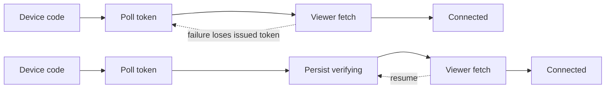

# Playlist & GitHub Bookmarks: Post-Remediation Grill

## Scope

This Select All review targets `codex/github-auth-live` after the first remediation pass. `npm run validate` passes 23 tests and the ZIP passes structural verification. Live Chrome OAuth, GraphQL Lists, and bookmark-tree inspection remain release gates, not completed evidence.

## [Skill: grill-recon] Findings

**Stack**: vanilla JavaScript, HTML, CSS, Chrome Manifest V3. **State**: `chrome.storage.local` and `chrome.storage.session`. **CI**: GitHub Actions validation, packaging, ZIP verification, retained artifact. **Dependencies**: zero runtime packages.

```text
extension/              # manifest, popup/options, service worker, providers, bookmarks
tests/                  # Node behavior tests
scripts/                # release ZIP verification
.github/workflows/      # validation and packaging
```

Key entry points are `extension/src/background.js`, `options.js`, `popup.js`, and `bookmarks.js`. Provider boundaries are `github*.js` and `youtube.js`. Ignored `extension.pem` and `extension.crx` exist beside the source; PEM contents were not read.

## Deduplicated Findings

### F1. Issued OAuth credentials are not resumable through viewer verification

- **File**: `extension/src/background.js:291-309`; `extension/src/github.js:151-157`
- **Observation**: Device Flow can consume the one-time code, receive a token, then lose it before account lookup finishes.
- **Severity**: `[HIGH]`
- **Evidence**: Credentials remain only in a local variable during a second network request. A rejection or worker death leads to re-polling an already-consumed code.
- **Proposed change**: Persist an attempt-scoped `verifying` phase immediately after exchange and resume viewer verification from stored credentials.
- **Effort**: `[< 1 week]`
- **Tradeoff**: Recovery becomes correct; temporary credentials require explicit cleanup.

### F2. Bookmark lookup failures are treated as missing bookmarks

- **File**: `extension/src/bookmarks.js:16-26,29-47,58-74,82-90`
- **Observation**: `chrome.bookmarks.get(...).catch(() => [])` collapses transient API errors and invalid IDs.
- **Severity**: `[HIGH]`
- **Evidence**: A transient error can create a replacement and overwrite ownership, or make archival discard its map while leaving the old tree unmanaged.
- **Proposed change**: Suppress only Chrome's explicit not-found error, rethrow infrastructure failures, and reconcile by canonical URL before replacement.
- **Effort**: `[< 1 week]`
- **Tradeoff**: Retry convergence improves; recovery adds one folder read and error classification.

### F3. The installable extension has no browser-level CI gate

- **File**: `extension/src/options.js:33-205`; `extension/src/popup.js:23-73`; `package.json:17-21`
- **Observation**: Node tests do not load Manifest V3 or execute popup/options UI.
- **Severity**: `[HIGH]`
- **Evidence**: Optional permission prompting, clipboard fallback, DOM selectors, options resume, and actual service-worker behavior are untested.
- **Proposed change**: Add an unpacked-Chrome smoke suite and retain manual live OAuth/bookmark acceptance.
- **Effort**: `[< 1 week]`
- **Tradeoff**: Shipped-surface evidence improves; CI and fixtures become heavier.

### F4. Release metadata still identifies the candidate as 1.1.1

- **File**: `package.json:3`; `extension/manifest.json:4`; `CHANGELOG.md:3-9`
- **Observation**: Major user-facing changes remain `Unreleased`, without a versioned tag/release approval path.
- **Severity**: `[HIGH]`
- **Evidence**: Resumable auth, optional permissions, privacy controls, and recovery differ materially from 1.1.1.
- **Proposed change**: After live acceptance, bump manifest/package together, date the changelog, and publish only the verified artifact through manual approval.
- **Effort**: `[< 1 day]`
- **Tradeoff**: Releases become traceable; ceremony increases slightly.

### F5. Provider fetches and sync runs have no durable timeout lease

- **File**: `extension/src/youtube.js:76-85`; `extension/src/github.js:68-81`; `extension/src/background.js:40-77`
- **Observation**: A stalled fetch can leave persisted state `running` after worker death.
- **Severity**: `[MEDIUM]`
- **Evidence**: Sync fetches lack `AbortSignal`; startup does not expire stale runs.
- **Proposed change**: Add bounded requests, retry network/429/5xx, and reconcile expired run leases.
- **Effort**: `[< 1 week]`
- **Tradeoff**: Status becomes bounded and truthful; shared request policy and clock tests are added.

### F6. Periodic sync alarm creation is not verified

- **File**: `extension/src/background.js:35-38,419-427`
- **Observation**: Automatic sync can appear configured after alarm creation fails.
- **Severity**: `[MEDIUM]`
- **Evidence**: `scheduleSync()` does not await/read back `create`; the interval listener has no rejection handler.
- **Proposed change**: Verify the alarm, record schedule health, and catch install/change failures.
- **Effort**: `[< 1 day]`
- **Tradeoff**: Adds one diagnostic field and read.

### F7. Initial code acquisition says “Retrying” but fails immediately

- **File**: `extension/src/github-auth.js:19-32`; `extension/src/background.js:161-169`
- **Observation**: Initial network errors are typed retryable, but start moves directly to terminal failed.
- **Severity**: `[MEDIUM]`
- **Evidence**: Error text promises retry while none occurs.
- **Proposed change**: Add bounded retries or change the message to “Try again.”
- **Effort**: `[< 1 day]`
- **Tradeoff**: Behavior and UI agree; retries may make Connect wait longer.

### F8. Permanent refresh failure leaves the account connected

- **File**: `extension/src/github-sync.js:12-25`; `extension/src/options.js:25-30`
- **Observation**: An invalid refresh token stays stored and is retried every interval.
- **Severity**: `[MEDIUM]`
- **Evidence**: Refresh errors do not clear credentials or store `reauth_required`.
- **Proposed change**: Classify `invalid_grant`, clear unusable credentials, and back off transient outages.
- **Effort**: `[< 1 day]`
- **Tradeoff**: State becomes truthful; an OAuth error taxonomy is needed.

### F9. GitHub mixed success is reported as total failure

- **File**: `extension/src/github-sync.js:63-90`; `extension/src/background.js:40-73`
- **Observation**: One failed List makes the whole attempt failed, unlike YouTube partial results.
- **Severity**: `[MEDIUM]`
- **Evidence**: `syncGitHubLists()` throws whenever any List fails.
- **Proposed change**: Return mixed results as partial; throw only for provider-wide or zero-success failure.
- **Effort**: `[< 1 day]`
- **Tradeoff**: Progress is truthful; UI handles one additional state.

### F10. Optional host permissions outlive active use

- **File**: `extension/manifest.json:6-8`; `extension/src/options.js:106-179`
- **Observation**: GitHub origins remain after Forget; YouTube is mandatory for GitHub-only users.
- **Severity**: `[MEDIUM]`
- **Evidence**: Connect requests GitHub origins, but disconnect never removes them.
- **Proposed change**: Remove GitHub origins on Forget and make YouTube provider-specific optional access.
- **Effort**: `[< 1 week]`
- **Tradeoff**: Least privilege improves; reconnect/first use prompts again.
- **Exploit scenario**: A future compromised update retains provider access after apparent disconnection.

### F11. GitHub bearer credentials are persistent profile data

- **File**: `extension/src/default-playlists.js:50-53`; `extension/src/background.js:298-305`
- **Observation**: `TRUSTED_CONTEXTS` narrows extension access but is not a credential vault.
- **Severity**: `[MEDIUM]`
- **Evidence**: Access and refresh tokens persist across restarts.
- **Proposed change**: Keep access tokens in session and make refresh persistence an explicit choice; use a broker only for stronger guarantees.
- **Effort**: `[< 1 week]`
- **Tradeoff**: Copied-profile exposure falls; reconnect friction or backend ownership rises.
- **Exploit scenario**: Same-user malware or a broad backup extracts a reusable token.

### F12. Private YouTube metadata lacks Chrome Sync disclosure parity

- **File**: `extension/src/youtube.js:76-85`; `extension/options.html:8-10`; `PRIVACY.md:23-25`
- **Observation**: Private GitHub has explicit opt-in; authenticated YouTube mirroring lacks equivalent disclosure.
- **Severity**: `[MEDIUM]`
- **Evidence**: Credentialed YouTube results become ordinary bookmarks that Chrome Sync may copy.
- **Proposed change**: Add a private-content/Chrome Sync acknowledgement beside YouTube destination setup.
- **Effort**: `[< 1 week]`
- **Tradeoff**: Consent is consistent; setup gains one acknowledgement.
- **Exploit scenario**: Private viewing metadata appears on another synced/shared device.

### F13. Auth recovery coverage is incomplete and concentrated

- **File**: `tests/github.test.mjs:173-344`; `extension/src/background.js:121-354`
- **Observation**: One timer-spin test covers many flows but omits expiry, tab failure, startup, retry exhaustion, and disconnect.
- **Severity**: `[MEDIUM]`
- **Evidence**: A 172-line case holds several independent scenarios and zero-delay polling loops.
- **Proposed change**: Extract an awaitable controller/harness and table-drive state transitions.
- **Effort**: `[< 1 week]`
- **Tradeoff**: Tests become deterministic; helpers add indirection.

### F14. Private/stale GitHub sync has only one default-path test

- **File**: `extension/src/github-sync.js:28-89`; `tests/github-sync.test.mjs:24-54`
- **Observation**: Opt-in, opt-out archival, manual preservation, refresh boundaries, and partial failure are missing.
- **Severity**: `[MEDIUM]`
- **Evidence**: The sole integration case checks default private exclusion.
- **Proposed change**: Add the privacy/destructive reconciliation matrix.
- **Effort**: `[< 1 week]`
- **Tradeoff**: Sensitive paths gain protection; fixtures grow.

### F15. CI has no coverage or lint threshold

- **File**: `package.json:16-21`; `.github/workflows/validate.yml:10-24`
- **Observation**: Syntax, tests, ZIP checks, and artifacts are present; promise/static checks and coverage are absent.
- **Severity**: `[MEDIUM]`
- **Evidence**: `validate` is `node --check` plus Node tests.
- **Proposed change**: Add ESLint and ratcheted Node coverage after UI/browser tests exist.
- **Effort**: `[< 1 day]`
- **Tradeoff**: Measurable regression signal improves; thresholds need upkeep.

### F16. The service worker is a control-plane monolith

- **File**: `extension/src/background.js:1-476`
- **Observation**: OAuth, migration, two providers, alarms, diagnostics, and dispatch share one module with global promises.
- **Severity**: `[MEDIUM]`
- **Evidence**: Tests import the full worker and mock the entire Chrome global.
- **Proposed change**: Extract an injectable auth controller and provider-run coordinator.
- **Effort**: `[< 1 week]`
- **Tradeoff**: Ownership and tests improve; two abstractions are added.

### F17. Duplicate or empty YouTube configuration has undefined semantics

- **File**: `extension/src/options.js:64-78`; `extension/src/background.js:356-416`
- **Observation**: Duplicate IDs overwrite maps; an empty list throws a blank error after cleanup.
- **Severity**: `[MEDIUM]`
- **Evidence**: No uniqueness check exists; success requires `ok.length > 0`, then empty failures are joined.
- **Proposed change**: Reject duplicates at save time and treat deliberate empty configuration as successful cleanup.
- **Effort**: `[< 1 day]`
- **Tradeoff**: Ownership becomes deterministic; one validation message is added.

### F18. The signing key remains beside the working tree

- **File**: `.gitignore:4-5`; local `extension.pem`; `scripts/verify-package.mjs:9-16`
- **Observation**: Mode is now `0600`, Git ignores it, and ZIP checks exclude it, but same-user tools/backups can encounter it.
- **Severity**: `[LOW]`
- **Evidence**: The key remains in Documents.
- **Proposed change**: Move it to encrypted storage after confirming sideload identity; rotate only by explicit migration decision.
- **Effort**: `[< 1 day]`
- **Tradeoff**: Accidental collection falls; local signing needs retrieval.
- **Exploit scenario**: A compromised same-user tool impersonates sideloaded builds.

### Good Findings

- **File**: `extension/src/background.js:80-354`; `tests/github.test.mjs:264-339`
- **Observation**: Attempt IDs, serialized transitions, stale-commit guards, poll single-flight, alarm leases, and cancellation races are materially stronger and directly tested.
- **Severity**: `[GOOD]`
- **Evidence**: Duplicate alarms cause one poll; cancellation blocks stale token overwrite; missing alarms recover.
- **Proposed change**: Preserve these invariants in extracted tests.
- **Effort**: `[< 1 day]`
- **Tradeoff**: Minor test maintenance.

- **File**: `.github/workflows/validate.yml:7-24`; `scripts/verify-package.mjs`; `extension/src/github-sync.js:28-33`
- **Observation**: Actions are SHA-pinned/read-only; ZIP contents are checked; private GitHub Lists default off; manual bookmarks survive source removal.
- **Severity**: `[GOOD]`
- **Evidence**: Current tests and packaging gates cover these behaviors.
- **Proposed change**: Retain them as release gates.
- **Effort**: `[< 1 day]`
- **Tradeoff**: Negligible maintenance.

## Architecture Review and Rewrite Plan

1. Keep secretless GitHub Device Flow and the backend-free architecture.
2. Extract `GitHubAuthController` with `requesting -> code -> pending -> verifying -> connected|failed` states.
3. Persist only attempt-scoped credentials needed to resume `verifying`.
4. Centralize bounded HTTP behavior and typed transient/permanent errors.
5. Keep provider sync single-flight and add durable run leases.
6. Centralize bookmark lookup/error classification and URL reconciliation.
7. Validate settings through versioned provider-scoped migrations.
8. Keep private-source consent provider-specific and visible.
9. Layer Node state tests, unpacked-Chrome smoke, and live acceptance.
10. Release only versioned, retained ZIPs after manual approval.

## Hard-Nosed Critique and Roadmap

The first remediation removed the consent race and improved release integrity. Remaining weakness is phase durability: token exchange, provider fetch, and bookmark calls still contain failure windows without explicit retry semantics. The 80/20 plan is F1, F2, F3, F4, then F6-F9. Prioritized 15-item backlog: F1, F2, F3, F4, F6, F8, F9, F17, F5, F13, F14, F10, F12, F15, F16. Quick wins: F4, F6-F9, F15, F17. Red flags: do not call Node tests browser verification; do not publish 1.1.1 with unreleased behavior; do not retry a consumed device code.

## Multi-Perspective Panel

- **Staff backend**: resumable `verifying`, extracted auth controller, explicit run leases.
- **Security**: lifecycle-bound permissions, reduced persistent-token exposure, YouTube privacy parity.
- **SRE**: bounded calls, verified alarms, stale-run expiry.
- **Performance**: preserve single-flight, avoid redundant page retries, reconcile only on lookup certainty.
- **Product**: truthful connected/reauth/partial states and no client-ID/PAT concepts.
- **Junior advocate**: split the 476-line worker and 172-line test at state-machine boundaries.

Unified resolution: preserve the no-backend product, but make each external-await boundary resumable or safely repeatable. Browser evidence is mandatory because the product depends on Chrome APIs.

## ADR Style

- **ADR-001 Secretless Device Flow**: keep public-client Device Flow; reject shipped secrets/PATs; accept code entry.
- **ADR-002 Attempt-scoped state**: every transition and commit carries `attemptId`; cancellation remains authoritative.
- **ADR-003 Resumable verification**: persist issued credentials before viewer lookup; explicit cleanup required.
- **ADR-004 Single-flight and leases**: one run per provider with deadline; manual runs may join.
- **ADR-005 Bookmark certainty**: only explicit not-found permits replacement; transient failures surface.
- **ADR-006 Optional provider permissions**: request at use and remove on Forget; prompts may recur.
- **ADR-007 Private metadata consent**: disclose Chrome Sync before mirroring private sources.
- **ADR-008 Evidence-based release**: Node, Chrome smoke, live OAuth/sync, version and ZIP checks, manual approval.

## Paranoid Mode

| # | Scenario | Likelihood | Impact | Risk | Component | File |
|---|---|---|---|---|---|---|
| 1 | Token issued, worker dies before viewer verification, consumed code is retried | Medium | High | HIGH | OAuth | `background.js:291` |
| 2 | Bookmark lookup transiently fails and duplicate ownership is checkpointed | Medium | High | HIGH | Bookmarks | `bookmarks.js:58` |
| 3 | Manifest/UI mismatch ships because Node never loads Chrome | Medium | High | HIGH | Release | `package.json:17` |
| 4 | Invalid refresh token is retried every minute | Medium | Medium | MEDIUM | OAuth sync | `github-sync.js:12` |
| 5 | Periodic alarm creation fails silently | Low | Medium | MEDIUM | Scheduling | `background.js:35` |
| 6 | Empty YouTube config throws blank error after cleanup | Medium | Low | MEDIUM | YouTube | `background.js:407` |
| 7 | Private metadata propagates to another Chrome device | Low | High | MEDIUM | Privacy | `PRIVACY.md:23` |

**Worst Case Verdict**: successful token issuance followed by worker death before persistence leaves approved access with a consumed one-time code and no reliable recovery.

## Add-On Pressure Tests

### Scale Stress
At 100x sources, serial bookmark mutations and storage checkpoints dominate. At double team size, `background.js` becomes the merge/ownership hotspot. Measure item count, duration, mutations, page count, and storage writes.

### Hidden Costs
Async Chrome lifecycle debugging; duplicated provider result semantics; repeated permission/privacy explanation; manual artifact reconstruction; onboarding into global Chrome mocks.

### Principle Violations
SRP in `background.js`; dependency inversion around global Chrome/fetch/time; least privilege for provider origins; fail-closed violation in bookmark lookup.

### Strangler Fig
Extract only `GitHubAuthController`, keeping message names as adapter. Then extract `ProviderRunCoordinator`, then bookmark lookup. No big-bang rewrite.

### Success Metrics
Auth completion >=99% excluding denial; zero stale commits; zero duplicate managed bookmarks under injected failure; all runs reach terminal state by deadline; Chrome smoke 100%; live OAuth/Lists/hierarchy/second-sync acceptance all pass; CI under five minutes.

### Before vs After



### Assumptions Audit
Verify live: Device Flow enabled; `read:user` reads intended Lists; optional origins work in options; real Chrome error text distinguishes missing bookmarks; Chrome Sync disclosure is understood; headless smoke does not replace stable-Chrome acceptance.

### Compact and Optimize
Extract repeated message responses, permission-origin constants, bounded fetch policy, and the test harness. Do not introduce a framework; compact ownership, not line count.

## Executive Summary

The candidate is substantially healthier: the consent race, duplicate poll, missing-alarm recovery, private GitHub default, source-removal safety, CI pinning, and ZIP integrity are fixed. It is not publishable until F1-F4 are closed. Top actions: add `verifying`, make bookmark lookup fail closed, then complete Chrome acceptance and version the artifact. Confidence is High for F1-F4; live GitHub scope confidence remains Medium until real-account testing.

## Fixing Plan

### Phase 1: Critical fixes (do immediately)
No `[CRITICAL]` findings remain.

### Phase 2: High-priority fixes (this sprint)
- **F1**: resumable `verifying`. **Effort** `[< 1 week]`. **Files**: background, GitHub API, auth tests.
- **F2**: classify not-found and reconcile. **Effort** `[< 1 week]`. **Files**: bookmarks and tests.
- **F3**: unpacked/live Chrome acceptance. **Effort** `[< 1 week]`. **Files**: scripts, workflow, tests.
- **F4**: version/tag only after acceptance. **Effort** `[< 1 day]`. **Files**: manifest, package, changelog.

### Phase 3: Medium-priority improvements (next sprint)
- **F5-F9**: bounded runs, alarm health, truthful retry/reauth/partial. **Effort** `[< 1 week]`.
- **F10-F12**: permission lifecycle, token choice, YouTube disclosure. **Effort** `[< 1 week]`.
- **F13-F15**: state/privacy matrix, lint, coverage. **Effort** `[< 1 week]`.
- **F16-F17**: extract controllers and validate configuration. **Effort** `[< 1 week]`.

### Phase 4: Low-priority cleanup (when touching these files)
- **F18**: move signing key after identity decision. **Effort** `[< 1 day]`.

### Dependency Graph
F3 depends on F1/F2. F4 depends on F3 and live acceptance. F13 becomes simpler after F16. F15 thresholds should follow F3.

### Estimated Total Effort
Phase 1: 0 days. Phase 2: 3-6 days. Phase 3: 4-8 days. Phase 4: <1 day. **Total**: 7-14 engineering days for the complete roadmap; 2-4 days for release-blocking scope.
