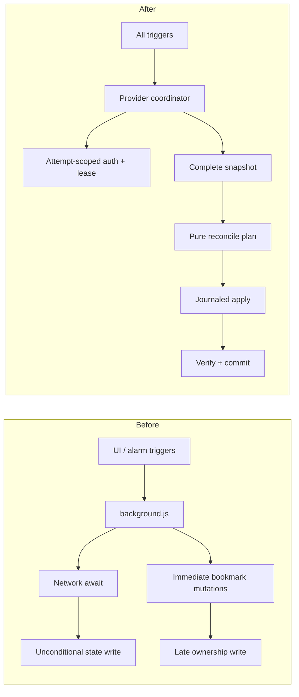

# Playlist & GitHub Bookmarks: Release-Candidate Grill

## Scope

This audit reviews branch `codex/github-auth-live` at `bc68229`, including the uncommitted auth hardening that followed that checkpoint. The target is a vanilla JavaScript Manifest V3 Chrome extension with no runtime dependencies. The audit is source-based. The 16 Node tests pass, but Chrome reload, live GitHub authorization, GraphQL List access, bookmark creation, and Chrome Web Store behavior remain unverified.

## [Skill: grill-recon] Findings

**Language/Framework**: JavaScript, HTML, CSS, Chrome Manifest V3
**Architecture**: service-worker orchestration, popup/options documents, provider adapters, shared bookmark reconciler
**Database**: none; `chrome.storage.local` and `chrome.storage.session`
**CI/CD**: GitHub Actions validation/package job
**Package manager**: npm, with zero runtime dependencies

### Directory Structure

```text
extension/
  manifest.json
  options.html
  popup.html
  src/
  styles/
tests/
.github/workflows/
outputs/
```

### Key Entry Points

- `extension/src/background.js`: alarms, messages, sync, and GitHub authorization.
- `extension/src/options.js`: configuration and GitHub connection UI.
- `extension/src/popup.js`: sync status and manual triggers.
- `extension/src/bookmarks.js`: shared bookmark reconciliation.
- `extension/src/github.js`, `youtube.js`: provider adapters.

### Size

- 10 source JavaScript files, 4 test files.
- Approximately 1,396 lines across source, UI, styles, and tests.
- `background.js` grew from 88 to 227 lines on the auth branch.

### Documentation and Artifacts

- README, privacy policy, changelog, contribution guide, and license exist.
- Ignored `extension.pem` and `extension.crx` exist beside the source. PEM contents were not read.
- The old report was replaced by this branch-current report.

## [Skill: grill-architecture] Findings

### A1. OAuth transitions lack persistent attempt identity

- **File**: `extension/src/background.js:56-134`
- **Observation**: Start, cancel, reconnect, and poll operate on a mutable session without an `attemptId` or compare-before-commit.
- **Severity**: `[CRITICAL]`
- **Evidence**: A poll captures the session at line 106, awaits token and viewer requests, then writes credentials at lines 116-123 without re-reading active state.
- **Proposed change**: Give every attempt an opaque ID, serialize transitions, and revalidate the ID after every external await and immediately before credential commit.
- **Effort**: `[< 1 week]`
- **Tradeoff**: Gain: Cancel and Disconnect become authoritative. Lose: additional state checks and concurrency tests.

### A2. Alarm polling has no durable lease or recovery reconciliation

- **File**: `extension/src/background.js:81-134,190-193`
- **Observation**: The one-shot alarm is consumed before the network poll completes; worker termination or alarm-creation failure can leave a valid attempt pending forever.
- **Severity**: `[HIGH]`
- **Evidence**: The next alarm is created only after a successful poll result at lines 129-131. No startup/status path compares `nextPollAt` with the actual alarm.
- **Proposed change**: Use a poll lease/recovery alarm, await Chrome API calls, and reconcile missing or overdue alarms on startup and status reads.
- **Effort**: `[< 1 week]`
- **Tradeoff**: Gain: authorization survives worker death and Chrome restarts within the session. Lose: a small recovery state machine.

### A3. Background orchestration is becoming a control-plane monolith

- **File**: `extension/src/background.js:1-227`
- **Observation**: One module now owns install migration, alarms, two provider sync paths, OAuth state, credential commit, tabs, and message dispatch.
- **Severity**: `[MEDIUM]`
- **Evidence**: Direct global `chrome` calls and private functions force tests to import the whole service worker with a large global mock.
- **Proposed change**: Extract an injectable GitHub auth controller and a provider sync coordinator; keep event registration thin.
- **Effort**: `[< 1 week]`
- **Tradeoff**: Gain: deterministic state-machine tests and clearer ownership. Lose: two small modules and dependency injection.

### A4. Provider synchronization still has no single-flight coordinator

- **File**: `extension/src/background.js:137-178,190-225`; `extension/src/github-sync.js:28-70`
- **Observation**: Alarm and manual triggers can run the same provider concurrently.
- **Severity**: `[HIGH]`
- **Evidence**: Both event paths call sync functions directly with no in-flight promise, generation, or commit guard.
- **Proposed change**: Coalesce each provider onto one active run and make later triggers request one pending rerun.
- **Effort**: `[< 1 day]`
- **Tradeoff**: Gain: prevents duplicate bookmark creation and stale map writes. Lose: manual sync may wait for an active run.

### A5. Bookmark reconciliation remains non-transactional

- **File**: `extension/src/bookmarks.js:29-65`
- **Observation**: Visible bookmark mutations occur before managed ownership state is committed.
- **Severity**: `[HIGH]`
- **Evidence**: Failure after a create/update/move leaves changed bookmarks but no returned managed map; retry can create unmanaged duplicates.
- **Proposed change**: Plan changes first, journal apply progress, verify the tree, and commit ownership only after convergence.
- **Effort**: `[< 1 week]`
- **Tradeoff**: Gain: interrupted retries converge. Lose: extra bookmark reads and recovery state.

### A6. Removed sources are not reconciled

- **File**: `extension/src/background.js:149-176`; `extension/src/github-sync.js:41-68`
- **Observation**: A removed playlist configuration or remote GitHub List disappears from the loop but its folder and managed map remain.
- **Severity**: `[HIGH]`
- **Evidence**: Only current source IDs are iterated; previous/current registries are never diffed.
- **Proposed change**: Maintain a source registry and archive extension-owned folders missing from a complete provider snapshot.
- **Effort**: `[< 1 week]`
- **Tradeoff**: Gain: stale trees stop accumulating. Lose: archive/delete semantics need explicit user policy.

### A7. Persistent state has no schema version

- **File**: `extension/src/default-playlists.js:34-56`; `extension/src/background.js:14-16`
- **Observation**: Shallow default merging is the only migration and validation mechanism.
- **Severity**: `[MEDIUM]`
- **Evidence**: Auth, token expiry, managed maps, duplicate source IDs, and nested values are trusted as stored.
- **Proposed change**: Add `schemaVersion`, validated parsing, and provider-scoped migrations/quarantine.
- **Effort**: `[< 1 week]`
- **Tradeoff**: Gain: upgrades and corrupted profiles fail predictably. Lose: state changes require migrations.

### A8. Provider adapters and public/private auth projection are good boundaries

- **File**: `extension/src/github.js`; `youtube.js`; `background.js:24-43`
- **Observation**: Provider parsing is isolated, and private `deviceCode` is omitted from runtime responses.
- **Severity**: `[GOOD]`
- **Evidence**: `publicGitHubAuth()` returns the user code and status but not the device credential.
- **Proposed change**: Preserve these boundaries while extracting coordination.
- **Effort**: `[< 1 day]`
- **Tradeoff**: Minor regression-test maintenance only.

## [Skill: grill-error-handling] Findings

### E1. Cancel, Disconnect, or Reconnect can lose to an in-flight poll

- **File**: `extension/src/background.js:56-134`; `extension/src/options.js:128-147`
- **Observation**: An old request can reconnect after cancellation or overwrite a newer account.
- **Severity**: `[CRITICAL]`
- **Evidence**: Cancellation deletes session state but cannot invalidate the local session object already held by the poll.
- **Proposed change**: Persistent attempt generations plus compare-before-commit and deferred-fetch race tests.
- **Effort**: `[< 1 day]`
- **Tradeoff**: Gain: user consent is reliable. Lose: extra session reads.

### E2. Transient provider failures become terminal authorization failures

- **File**: `extension/src/github-auth.js:23-61`; `extension/src/background.js:112-134`
- **Observation**: Network, 429, 5xx, malformed response, and viewer lookup errors all discard the valid attempt.
- **Severity**: `[MEDIUM]`
- **Evidence**: The catch writes a secret-free failed state and removes all retry context.
- **Proposed change**: Typed errors, fetch deadlines, retry budget, jitter, and terminal classification only for denial/expiry/invalid grant.
- **Effort**: `[< 1 week]`
- **Tradeoff**: Gain: brief outages no longer force restart. Lose: longer failure determination and more tests.

### E3. Credential and UI state can split across storage areas

- **File**: `extension/src/background.js:114-123,46-53`
- **Observation**: Local credentials are written before session state becomes connected.
- **Severity**: `[MEDIUM]`
- **Evidence**: Termination between the writes leaves valid tokens hidden behind an old pending session, which status prioritizes.
- **Proposed change**: Persist a shared commit ID and reconcile local/session disagreement.
- **Effort**: `[< 1 day]`
- **Tradeoff**: Gain: truthful recovery. Lose: versioned auth state.

### E4. Alarm infrastructure failures can escape unhandled

- **File**: `extension/src/background.js:105-134,190-193`
- **Observation**: The alarm listener discards the promise, and storage reads/failure persistence sit outside a complete error boundary.
- **Severity**: `[MEDIUM]`
- **Evidence**: `pollGitHubAuthorization()` is invoked without await or catch; its inner try begins after session access.
- **Proposed change**: Export an awaitable handler, attach a final catch, and persist sanitized phase/error/timestamp.
- **Effort**: `[< 1 day]`
- **Tradeoff**: Gain: no invisible rejections and deterministic tests. Lose: a small diagnostics schema.

### E5. Options async actions lack common recovery boundaries

- **File**: `extension/src/options.js:94-160`
- **Observation**: Continue, Cancel, Disconnect, Sync, Save, and initial load can reject without restoring buttons or rendering a stable error.
- **Severity**: `[MEDIUM]`
- **Evidence**: Continue catches clipboard only; duplicate clicks remain possible while messages are in flight.
- **Proposed change**: One UI task helper with `try/catch/finally`, response validation, and transition-level busy state.
- **Effort**: `[< 1 day]`
- **Tradeoff**: Gain: controls always recover. Lose: modest helper code.

### E6. Scheduled sync failures remain silent

- **File**: `extension/src/background.js:190-200`
- **Observation**: Automatic YouTube and GitHub failures are discarded and stale success remains visible.
- **Severity**: `[HIGH]`
- **Evidence**: Both scheduled calls end in `.catch(() => undefined)`; settings-read rejection has no catch.
- **Proposed change**: Route all runs through a common executor recording trigger, phase, timestamps, success/partial/failure, and sanitized error.
- **Effort**: `[< 1 day]`
- **Tradeoff**: Gain: truthful health. Lose: small bounded local attempt history.

### E7. The new session-storage boundary is a material improvement

- **File**: `extension/src/background.js:24-43,56-134`; `options.js:33-58`
- **Observation**: Auth progress now survives options-page navigation without exposing `deviceCode`.
- **Severity**: `[GOOD]`
- **Evidence**: Session changes drive UI refresh and public messages omit the polling credential.
- **Proposed change**: Preserve it and add worker-reload tests.
- **Effort**: `[< 1 day]`
- **Tradeoff**: Test maintenance only.

## [Skill: grill-security] Findings

### S1. The private signing key is world-readable beside the source

- **File**: `.gitignore:4-5`; local `extension.pem` mode `0644`
- **Observation**: Git ignores the key, but every local account can read it.
- **Severity**: `[HIGH]`
- **Evidence**: `extension.pem` is `-rw-r--r--`; `extension.crx` is `0600`.
- **Proposed change**: Move it outside the repo/synced Documents, restrict to `0600`, and rotate before relying on the sideloaded identity.
- **Effort**: `[< 1 day]`
- **Tradeoff**: Gain: protects distribution identity. Lose: rotation changes sideloaded extension identity.
- **Exploit scenario**: A local process signs a malicious CRX with the copied key.

### S2. Long-lived bearer credentials remain in local storage

- **File**: `extension/src/background.js:114-123`; `github-sync.js:12-25`
- **Observation**: Access and refresh tokens persist in a profile store, not a credential vault.
- **Severity**: `[MEDIUM]`
- **Evidence**: Both token fields are stored alongside ordinary settings.
- **Proposed change**: Session access tokens, explicit “Stay connected” refresh persistence, and trusted-context storage access.
- **Effort**: `[< 1 week]`
- **Tradeoff**: Gain: less credential exposure. Lose: optional reconnect friction.
- **Exploit scenario**: Malware with profile access extracts the refresh token.

### S3. Disconnect is not GitHub revocation

- **File**: `extension/src/options.js:134-148`; `PRIVACY.md:17`
- **Observation**: The action forgets local credentials but leaves the GitHub grant valid.
- **Severity**: `[MEDIUM]`
- **Evidence**: No revocation API or settings link exists.
- **Proposed change**: Rename to “Forget on this device” and provide a direct revocation link; do not ship a client secret.
- **Effort**: `[< 1 day]`
- **Tradeoff**: Gain: truthful semantics. Lose: manual revocation is one extra step.
- **Exploit scenario**: A copied refresh token remains usable after local disconnect.

### S4. Private source metadata can propagate through Chrome Sync

- **File**: `extension/src/github.js:117-124`; `github-sync.js:41-54`; `PRIVACY.md:23-25`
- **Observation**: Private Lists are mirrored as ordinary bookmarks without explicit secondary-sync consent.
- **Severity**: `[MEDIUM]`
- **Evidence**: `isPrivate` is parsed but ignored.
- **Proposed change**: Exclude private sources by default or require explicit opt-in and disclosure.
- **Effort**: `[< 1 week]`
- **Tradeoff**: Gain: informed privacy. Lose: setup friction.
- **Exploit scenario**: A private research collection appears on another synced/shared device.

### S5. Provider host permissions are unconditional

- **File**: `extension/manifest.json:6-7`
- **Observation**: Every install grants YouTube and GitHub origins whether used or not.
- **Severity**: `[MEDIUM]`
- **Evidence**: All origins are in `host_permissions`.
- **Proposed change**: Use provider-specific `optional_host_permissions`.
- **Effort**: `[< 1 week]`
- **Tradeoff**: Gain: least privilege. Lose: another consent/denial state.
- **Exploit scenario**: A compromised update immediately reaches both providers.

### S6. CI Action tags and token permissions are not hardened

- **File**: `.github/workflows/validate.yml:1-16`
- **Observation**: Actions use mutable major tags and implicit workflow permissions.
- **Severity**: `[MEDIUM]`
- **Evidence**: `checkout@v4`, `setup-node@v4`, no `permissions`.
- **Proposed change**: Pin SHAs and set `permissions: contents: read`.
- **Effort**: `[< 1 day]`
- **Tradeoff**: Gain: reproducible least-privilege CI. Lose: SHA update maintenance.
- **Exploit scenario**: A compromised tag runs with broader-than-needed repository access.

### S7. Provider URLs need validation

- **File**: `extension/src/github.js:88-94`; `youtube.js:76-86`
- **Observation**: GitHub bookmark URLs and YouTube fetch origins are trusted.
- **Severity**: `[LOW]`
- **Evidence**: External URLs flow into bookmarks/fetch without protocol-host allowlisting.
- **Proposed change**: Require canonical YouTube IDs/URLs and HTTPS `github.com` repository URLs.
- **Effort**: `[< 1 day]`
- **Tradeoff**: Gain: closes confused-deputy/phishing paths. Lose: enterprise hosts need allowlisting.
- **Exploit scenario**: A hostile response plants an off-domain bookmark or redirects a credentialed fetch.

### S8. Internal message and DOM boundaries are conservative

- **File**: `extension/manifest.json:6-16`; `background.js:24-43`; `options.js:33-57`
- **Observation**: No content scripts, external messages, web-accessible resources, `innerHTML`, or client secret exist.
- **Severity**: `[GOOD]`
- **Evidence**: Auth commands are internal and provider strings use `textContent`.
- **Proposed change**: Add regression guards before expanding the manifest surface.
- **Effort**: `[< 1 day]`
- **Tradeoff**: Minor test maintenance.
- **Exploit scenario**: N/A in the current manifest.

## [Skill: grill-testing] Findings

### T1. Authorization races and recovery transitions are untested

- **File**: `tests/github.test.mjs:137-229`; `background.js:46-135`
- **Observation**: Tests cover sequential pending-to-connected only.
- **Severity**: `[HIGH]`
- **Evidence**: No cancel/restart during deferred token/viewer requests, duplicate alarm, denial, expiry, tab rollback, or storage/alarm failure cases.
- **Proposed change**: Table-driven state-machine tests with injected time and deferred promises.
- **Effort**: `[< 1 week]`
- **Tradeoff**: Gain: executable concurrency contract. Lose: richer fixtures.

### T2. The new UI flow has no DOM or extension test

- **File**: `extension/options.html:12-25`; `options.js:33-166`
- **Observation**: Selector compatibility, clipboard fallback, reopen, cancel, and error rendering are untested.
- **Severity**: `[HIGH]`
- **Evidence**: No test imports `options.js` or loads the unpacked extension.
- **Proposed change**: DOM behavior tests plus one Chromium extension smoke journey.
- **Effort**: `[< 1 week]`
- **Tradeoff**: Gain: tests what the user sees. Lose: browser CI maintenance.

### T3. Non-auth background behavior remains uncovered

- **File**: `background.js:137-227`; `tests/github.test.mjs:156-229`
- **Observation**: The background import test stubs install/storage listeners and never exercises provider sync orchestration.
- **Severity**: `[HIGH]`
- **Evidence**: No install, interval, scheduled sync, manual sync, or partial-result assertions.
- **Proposed change**: Reusable Chrome harness capturing every listener and both providers.
- **Effort**: `[< 1 week]`
- **Tradeoff**: Gain: the whole service worker becomes protected. Lose: broader mocks.

### T4. Release gates did not grow with the subsystem

- **File**: `.github/workflows/validate.yml`; `package.json`; `manifest.json`; `CHANGELOG.md`
- **Observation**: CI still proves syntax, 16 Node tests, and ZIP command success only.
- **Severity**: `[HIGH]`
- **Evidence**: No coverage, lint, version consistency, Chrome load, ZIP verification, artifact retention, or staging gate.
- **Proposed change**: Add these gates before merge and require manual approval for Web Store publication.
- **Effort**: `[< 1 week]`
- **Tradeoff**: Gain: green CI becomes release evidence. Lose: longer CI.

### T5. Bookmark partial-failure recovery remains untested

- **File**: `tests/bookmarks.test.mjs:5-60`; `bookmarks.js:29-65`
- **Observation**: The mock always succeeds through destructive state changes.
- **Severity**: `[HIGH]`
- **Evidence**: No failure-after-N or retry-convergence test exists.
- **Proposed change**: Failure injection for create/update/move/remove followed by retry.
- **Effort**: `[< 1 week]`
- **Tradeoff**: Gain: evidence against duplicate/data-loss regressions. Lose: more elaborate fixtures.

### T6. Single-poll auth extraction improved testability

- **File**: `github-auth.js:33-61`; `tests/github.test.mjs:100-119`
- **Observation**: Pending, slow-down, and authorized protocol results are explicit and injected.
- **Severity**: `[GOOD]`
- **Evidence**: Tests verify private-device-code redaction and alarm rescheduling.
- **Proposed change**: Keep this primitive; remove the unused legacy loop when migration is complete.
- **Effort**: `[< 1 day]`
- **Tradeoff**: Gain: smaller surface. Lose: none if no production caller remains.

## [Skill: grill-edge-cases] Findings

### X1. Stale authorization can resurrect after consent withdrawal

- **File**: `background.js:56-134`
- **Observation**: Cancel or Disconnect during an in-flight poll does not invalidate its later write.
- **Severity**: `[CRITICAL]`
- **Evidence**: No attempt ID or active-state recheck exists after network awaits.
- **Proposed change**: Persistent attempt generation, poll mutex, and compare-before-commit.
- **Effort**: `[< 1 day]`
- **Tradeoff**: Gain: consent is authoritative. Lose: more transition checks.

### X2. Overlapping polls can overwrite connected state with failure

- **File**: `background.js:81-134,190-193`
- **Observation**: Duplicate Continue/alarm delivery can poll the same device code concurrently.
- **Severity**: `[HIGH]`
- **Evidence**: There is no per-attempt poll lease or in-flight promise.
- **Proposed change**: Idempotent Continue and a stored/in-memory poll lease keyed by attempt ID.
- **Effort**: `[< 1 day]`
- **Tradeoff**: Gain: one transition at a time. Lose: duplicate requests wait/no-op.

### X3. Worker death after alarm consumption can strand the attempt

- **File**: `background.js:105-134,190-193`
- **Observation**: No watchdog repairs a consumed alarm whose poll did not schedule the next wake-up.
- **Severity**: `[HIGH]`
- **Evidence**: Pending state and future alarm are not reconciled.
- **Proposed change**: Recovery lease and overdue-status reconciliation.
- **Effort**: `[< 1 week]`
- **Tradeoff**: Gain: eventual progress. Lose: lease logic.

### X4. Auth success can split across local and session storage

- **File**: `background.js:114-123,46-53`
- **Observation**: Termination between writes can leave the UI pending with valid credentials.
- **Severity**: `[MEDIUM]`
- **Evidence**: Two separate storage commits have no shared generation.
- **Proposed change**: Commit ID and disagreement reconciliation.
- **Effort**: `[< 1 day]`
- **Tradeoff**: Gain: truthful recovery. Lose: migration fields.

### X5. Concurrent sync can create unmanaged duplicate bookmarks

- **File**: `background.js:137-225`; `bookmarks.js:29-65`
- **Observation**: Two runs can read the same old map, both create, and persist different IDs.
- **Severity**: `[CRITICAL]`
- **Evidence**: No provider lock and no transaction/journal.
- **Proposed change**: Single-flight plus idempotent journaled reconciliation.
- **Effort**: `[< 1 week]`
- **Tradeoff**: Gain: convergence. Lose: serialization and recovery state.

### X6. Refresh-token rotation can race

- **File**: `github-sync.js:12-25`; `background.js:190-225`
- **Observation**: Concurrent GitHub syncs can refresh from the same token and stale-write a rotated pair.
- **Severity**: `[HIGH]`
- **Evidence**: Refresh sits outside any GitHub provider lock.
- **Proposed change**: Put refresh and sync under one provider coordinator with token-generation compare-and-set.
- **Effort**: `[< 1 day]`
- **Tradeoff**: Gain: valid token lineage. Lose: serialized GitHub work.

### X7. Pagination can loop without cursor progress

- **File**: `extension/src/github.js:97-127`
- **Observation**: `hasNextPage: true` with a repeated/null cursor loops indefinitely.
- **Severity**: `[HIGH]`
- **Evidence**: No changed-cursor invariant or page/item cap exists.
- **Proposed change**: Require a non-null changed cursor and enforce page/item limits.
- **Effort**: `[< 1 day]`
- **Tradeoff**: Gain: bounded work. Lose: anomalous huge Lists fail closed.

### Edge Case Risk Matrix

| # | Scenario | Likelihood | Impact | Risk | Component | File |
|---:|---|---|---|---|---|---|
| 1 | Canceled auth later writes tokens | Medium | High | CRITICAL | OAuth | `background.js:56-134` |
| 2 | Concurrent sync creates unmanaged duplicates | Medium | High | CRITICAL | Bookmarks | `background.js:137-225` |
| 3 | Alarm consumed before worker death | Medium | High | HIGH | OAuth | `background.js:105-134` |
| 4 | Refresh-token rotation race | Low-Medium | High | HIGH | GitHub sync | `github-sync.js:12-25` |
| 5 | Repeated GraphQL cursor loops forever | Low | High | HIGH | GitHub API | `github.js:97-127` |
| 6 | Local/session auth split | Low-Medium | Medium | MEDIUM | OAuth state | `background.js:46-123` |

### Worst Case Verdict

The single scariest case is a delayed OAuth response writing credentials after the user explicitly canceled or disconnected, because it violates consent invisibly and can then feed automatic bookmark sync.

## Deduplicated Master Findings

| ID | Severity | Finding |
|---|---|---|
| F1 | CRITICAL | Stale OAuth completion can override Cancel/Disconnect |
| F2 | CRITICAL | Concurrent non-transactional sync can create unmanaged duplicates |
| F3 | HIGH | Auth alarm lifecycle can strand pending attempts |
| F4 | HIGH | Provider sync and refresh lack single-flight |
| F5 | HIGH | Bookmark reconciliation lacks recovery |
| F6 | HIGH | Removed sources remain stale |
| F7 | HIGH | Private signing key custody is unsafe |
| F8 | HIGH | Auth transition/recovery matrix is untested |
| F9 | HIGH | UI and live extension journey are untested |
| F10 | HIGH | Non-auth background control flow is untested |
| F11 | HIGH | Release gates are below subsystem risk |
| F12 | HIGH | Pagination lacks progress bounds |
| F13 | HIGH | Scheduled failures are swallowed |
| F14 | MEDIUM | Auth state can split across storage areas |
| F15 | MEDIUM | Transient auth failures are terminal |
| F16 | MEDIUM | Persistent state lacks schema validation |
| F17 | MEDIUM | Token storage/revocation/privacy need explicit policy |
| F18 | MEDIUM | Permissions and CI are not least-privileged |
| F19 | MEDIUM | Options async recovery is inconsistent |
| F20 | LOW | Provider URLs are not canonicalized/validated |
| F21 | GOOD | Zero runtime dependencies and private/public auth projection are strong |

# Style 1: Architecture Review and Rewrite Plan

## Ten Deliverables

1. **Redesign decision**: keep the no-backend Device Flow, but define it as an explicit persisted state machine with attempt and commit generations.
2. **New architecture**: thin Chrome event adapters -> auth controller/provider coordinator -> provider adapters -> pure reconcile planner -> journaled applier.
3. **Data model**: versioned provider state, `attemptId`, `commitId`, poll lease, source registry, and bounded attempt history.
4. **Reliability**: provider single-flight, fetch deadlines/backoff, cursor bounds, alarm recovery, and complete-snapshot deletion gates.
5. **Security**: cancel-safe commit, signing-key rotation, session access token, explicit refresh persistence, private-source consent, optional hosts.
6. **Testing**: table-driven auth state machine, failure-injected bookmarks, background harness, DOM tests, and unpacked Chrome smoke.
7. **Performance**: coalesce triggers, skip no-op bookmark mutations, cap pages/items, and adapt the one-minute default.
8. **DX**: extract controllers with injected Chrome/request/clock ports and one `SyncOutcome` contract.
9. **Migration**: introduce schema/coordination behind existing UI, migrate auth, then bookmarks, then permissions.
10. **Keep**: provider isolation, no client secret, zero runtime dependencies, managed-only deletion, text-only rendering.

# Style 2: Hard-Nosed Critique and Roadmap

The branch solved the visible lifecycle problem but replaced a page-owned linear loop with a distributed state machine that does not yet have the two things distributed state machines require: identity and recovery. Shipping now would make Cancel untrustworthy and pending states nonrecoverable.

## 80/20 Plan

1. Fix F1 with attempt IDs, poll lease, and compare-before-commit.
2. Fix F2/F4/F5 with provider locks and journaled reconciliation.
3. Prove those guarantees with deferred/failure-injection tests.
4. Fix signing custody and release gates.
5. Only then perform live Chrome authorization and package/release.

## Prioritized 15-Item Backlog

| Rank | Item | Impact | Risk | Effort | Trace |
|---:|---|---|---|---|---|
| 1 | Cancel-safe auth attempt generations | Very high | Consent | <1 day | F1 |
| 2 | Poll lease and alarm recovery | Very high | Stuck auth | <1 week | F3 |
| 3 | GitHub provider single-flight incl. refresh | Very high | Token/bookmark races | <1 day | F4 |
| 4 | YouTube provider single-flight | High | Duplicate bookmarks | <1 day | F2 |
| 5 | Journaled bookmark reconciliation | Very high | Integrity | <1 week | F5 |
| 6 | Deferred auth race tests | High | Regression | <1 week | F8 |
| 7 | Bookmark failure-injection tests | High | Integrity | <1 week | F5 |
| 8 | Cursor progress/page caps | High | Unbounded work | <1 day | F12 |
| 9 | Source registry/archive policy | High | Stale trees | <1 week | F6 |
| 10 | Truthful scheduled attempt state | High | False health | <1 day | F13 |
| 11 | Rotate/relocate signing key | High | Identity theft | <1 day | F7 |
| 12 | DOM and unpacked Chrome smoke | High | Release blindness | <1 week | F9 |
| 13 | Background orchestration tests | High | Control-plane regressions | <1 week | F10 |
| 14 | CI/release gates | High | Bad artifact | <1 week | F11 |
| 15 | Privacy/permission/token policy | Medium | Exposure | <1 week | F17-F18 |

## Red Flags

- Cancel does not yet guarantee cancellation.
- A consumed auth alarm can leave no future wake-up.
- A green Node suite does not prove the extension loads.
- The signing key is less protected than the CRX.
- Existing bookmark races predate auth and remain release blockers.

## Quick Wins

**Under one day**: F1 attempt guard, F4 single-flight, F7 key mode/location, F12 cursor bounds, F13 attempt state, F18 CI permissions, F20 URL validation.

**Under one week**: alarm recovery, bookmark journal, source registry, auth/background/DOM test matrix, Chrome smoke, privacy/permission flow.

# Style 3: Multi-Perspective Panel

## Staff Backend

1. Attempt and commit generations for auth. Risk: state complexity; benefit: correct cancellation.
2. Provider coordinator for all triggers. Risk: queued work; benefit: deterministic state.
3. Pure planner plus journaled apply. Risk: more code; benefit: recovery.

## Security

1. Cancel-safe credential commit.
2. Rotate/relocate the signing key.
3. Make private mirroring and persistent refresh credentials explicit consent.

## SRE

1. Alarm lease/watchdog.
2. Bounded timeouts/retries/cursor limits.
3. Every attempt recorded with phase and final state.

## Performance

1. Coalesce overlapping runs.
2. Skip no-op moves/updates.
3. Cap provider pages and adapt sync frequency.

## Product

1. Define Cancel, Disconnect, and revoke semantics honestly.
2. Show last attempt separately from last success.
3. Define source removal/archive and private-source policies.

## Junior Developer Advocate

1. Extract an auth controller from `background.js`.
2. Provide one reusable fake Chrome harness.
3. Remove the unused legacy polling loop after migration.

## Unified Resolution

Fix consent and data-integrity invariants first, then recovery and testability, then privacy/permissions and packaging. Do not add a backend merely to imitate one-click OAuth.

# Style 4: Architecture Decision Records

## ADR-001: Keep Secretless Device Flow

- **Context**: Web OAuth token exchange requires a client secret or broker.
- **Decision**: Keep Device Flow and no project backend.
- **Alternatives**: Embedded secret; hosted OAuth broker.
- **Consequences**: One copy/paste step; simpler privacy and operations.
- **Migration**: Improve copy/continue UX and live-test it.

## ADR-002: Attempt-Scoped Authorization

- **Context**: Stale polls can override user intent.
- **Decision**: Every attempt gets an immutable random ID and guarded commits.
- **Alternatives**: In-memory abort only; deletion-only cancellation.
- **Consequences**: Correct across worker restarts; more state checks.
- **Migration**: Seed new attempts only; old sessions become invalid.

## ADR-003: Poll Lease and Watchdog

- **Context**: One-shot alarms can be consumed before rescheduling.
- **Decision**: Persist lease state and repair missing/overdue alarms.
- **Alternatives**: Page timer; repeating alarm.
- **Consequences**: Recoverable MV3 lifecycle; explicit watchdog logic.
- **Migration**: Reconcile on status and worker startup.

## ADR-004: Provider Single-Flight

- **Context**: Manual and scheduled work overlaps.
- **Decision**: One active run per provider, including token refresh.
- **Alternatives**: Global lock; optimistic last-write-wins.
- **Consequences**: Deterministic state; same-provider requests wait.
- **Migration**: Route messages and alarms through coordinator.

## ADR-005: Journal Bookmark Apply

- **Context**: Chrome bookmarks have no transaction.
- **Decision**: Plan, journal, apply idempotently, verify, commit.
- **Alternatives**: Best-effort rollback; title-based discovery.
- **Consequences**: Recovery at the cost of explicit journal state.
- **Migration**: YouTube first, then GitHub.

## ADR-006: Version Storage

- **Context**: Defaults are not migrations.
- **Decision**: Add a validated schema version.
- **Alternatives**: Reset state on upgrade.
- **Consequences**: Predictable upgrades; migration upkeep.
- **Migration**: Treat current state as v1 and back it up during v2 migration.

## ADR-007: Complete Snapshots Gate Deletion

- **Context**: Partial provider reads can look like removals.
- **Decision**: Delete/archive only from complete, bounded snapshots.
- **Alternatives**: Never delete; always trust partial data.
- **Consequences**: Stale items may remain one run; valid data is safer.
- **Migration**: Add snapshot completeness before source cleanup.

## ADR-008: Release Requires Chrome Evidence

- **Context**: Node tests cannot prove manifest/UI/runtime integration.
- **Decision**: Required unpacked-extension smoke plus manual live OAuth acceptance.
- **Alternatives**: Manual-only; Node-only.
- **Consequences**: Slower CI; credible release claims.
- **Migration**: Start as a release job, then require it.

## ADR-009: Private Sources Require Explicit Consent

- **Context**: Chrome Sync can replicate bookmark metadata.
- **Decision**: Private sources are excluded or opted in with disclosure.
- **Alternatives**: Mirror silently; abandon bookmarks.
- **Consequences**: More setup clarity and friction.
- **Migration**: Surface `isPrivate` before enabling cleanup.

## ADR-010: Distribution Keys Stay Outside Source

- **Context**: Local PEM custody is unsafe.
- **Decision**: Rotate, encrypt, and separate local signing from Web Store signing.
- **Alternatives**: Ignore-only; commit encrypted key.
- **Consequences**: More release discipline; safer identity.
- **Migration**: Retire the current sideload key before public release.

# Style 5: Paranoid Mode

## Failure Chains

### Consent resurrection

Pending poll -> user Disconnects -> session/token clear -> delayed poll returns -> old credentials are stored -> alarm sync resumes -> user believes access ended.

### Duplicate bookmark tree

Alarm sync reads map M0 -> manual sync reads M0 -> both create the same item -> each stores a different managed ID -> one duplicate becomes unmanaged -> future retries multiply it.

### Permanent pending auth

Alarm fires -> network poll starts -> worker terminates -> alarm is consumed -> session remains pending -> no watchdog recreates the alarm -> UI waits forever.

## Paranoid Verdict

The most dangerous outcome is silent consent and integrity failure: a canceled authorization can reconnect, then concurrent automatic sync can create unmanaged bookmark trees that Chrome Sync propagates to other devices.

# Add-On 1: Scale Stress

At 100x sources/items, overlapping one-minute runs become routine, full bookmark reordering dominates, provider rate limits become normal, storage maps grow without compaction, and unbounded pagination becomes a resource incident. Correctness primitives needed now—single-flight, cursor bounds, no-op planning, completeness gates—also solve the 100x case.

# Add-On 2: Hidden Costs

1. Manual cleanup of unmanaged duplicates.
2. YouTube parser fixture maintenance.
3. OAuth denial/expiry/revocation support.
4. Privacy support for Chrome Sync propagation.
5. Signing-key and Web Store identity custody.

# Add-On 3: Principle Violations

- **SRP**: `background.js` owns unrelated auth and sync domains.
- **DIP**: Core state logic depends directly on global Chrome/fetch/time.
- **Least privilege**: provider hosts are install-time permissions.
- **Least authority**: persistent refresh credentials are default.
- **Fail-safe defaults**: private sources mirror without opt-in.

# Add-On 4: Strangler-Fig Migration

1. Extract auth controller behind existing messages.
2. Add attempt IDs and poll lease; delete old auth code after equivalence tests.
3. Introduce provider coordinator and route all triggers through it.
4. Extract reconcile planner behind `mirrorPlaylist`.
5. Journal apply for YouTube, then GitHub.
6. Add schema/source registry, then optional permissions.

# Add-On 5: Success Metrics

| Metric | Target | Evidence |
|---|---:|---|
| Credentials written after Cancel/Disconnect | 0/1,000 race runs | Deferred auth tests |
| Duplicate managed bookmarks under overlap | 0/100 runs | Concurrency harness |
| Recovery after failure at every mutation step | 100% convergence | Failure injection |
| Pending auth without a real alarm/lease | 0 | Watchdog tests |
| Destructive reconcile from incomplete snapshot | 0 | Completeness tests |
| Unpacked extension smoke | 100% release runs | CI |
| Private source without opt-in | 0 | Settings/state tests |
| Live OAuth + GitHub Lists acceptance | Pass before release | Current Chrome |

# Add-On 6: Before vs After



# Add-On 7: Assumptions Audit

| Assumption | Status | Validation |
|---|---|---|
| Cancel prevents credential writes | False | Deferred poll race test |
| One-shot alarm always leads to another | Unproven | Worker-death/watchdog test |
| `read:user` can read real Lists | Unproven | Live OAuth + GraphQL |
| Chrome extension reloads current folder | Unproven | User reload and visible UI |
| Two syncs never overlap | False | Forced concurrent triggers |
| Bookmark APIs fail atomically | False | Failure-after-N tests |
| Last success describes health | False | Latest-attempt failure test |
| Private bookmarks remain local | Unproven | Disclosure/Chrome Sync policy |
| ZIP matches source/version | Unproven | Artifact verifier |

# Add-On 8: Compact and Optimize

- Extract auth controller; keep `background.js` as registration.
- Remove unused `pollForGitHubToken` after migration.
- Use one `SyncOutcome` and one UI task helper.
- Reuse one fake Chrome harness.
- Consolidate timeout/backoff/request classification.
- Eliminate direct event-to-sync calls and arbitrary-origin provider URLs.

# Executive Summary

The branch is directionally better but not releasable. Moving Device Flow to session-backed background polling fixes the original page-lifetime failure and avoids a client secret, yet the new state machine can still write credentials after cancellation and can remain pending forever after an alarm/worker interruption. Existing concurrent bookmark reconciliation, signing-key custody, and missing Chrome release evidence remain independent blockers.

## Top Three Actions

1. Add attempt generations, poll lease, and cancel-safe commit. **Confidence: High.**
2. Add provider single-flight and journaled bookmark reconciliation with failure injection. **Confidence: High.**
3. Rotate signing material and require unpacked Chrome/live OAuth release evidence. **Confidence: High.**

**Paranoid verdict**: a delayed OAuth response can silently restore authorization after Disconnect, then concurrent sync can create unmanaged bookmarks and propagate them through Chrome Sync.

## Fixing Plan

### Phase 1: Critical fixes

- **F1**: attempt IDs, transition serialization, compare-before-commit, cancel tombstone, race tests.
  - **Files**: `background.js`, auth controller/tests
  - **Effort**: `[< 1 week]`
- **F2**: provider single-flight plus journaled/idempotent bookmark reconciliation.
  - **Files**: `background.js`, `github-sync.js`, `bookmarks.js`, tests
  - **Effort**: `[< 1 week]`

### Phase 2: High-priority fixes

- **F3**: poll lease, alarm reconciliation, request deadline.
- **F4**: serialize sync and refresh under provider coordinators.
- **F5**: failure-injected bookmark convergence.
- **F6**: source registry and archive-first removal.
- **F7**: rotate/relocate/chmod signing key.
- **F8-F10**: auth, UI, and background test matrices.
- **F11**: Chrome smoke, coverage, artifact/version/release gates.
- **F12**: cursor progress and limits.
- **F13**: durable latest-attempt health.

### Phase 3: Medium-priority improvements

- **F14-F16**: auth commit reconciliation, transient retry classification, schema v2.
- **F17**: explicit refresh persistence, truthful disconnect/revocation, private-source consent.
- **F18**: optional host permissions and CI least privilege.
- **F19**: common UI async boundary.

### Phase 4: Low-priority cleanup

- **F20**: canonicalize GitHub/YouTube URLs when touching provider adapters.
- Remove unused legacy polling after auth migration.

### Dependency Graph

```text
F1 attempt identity -> F3 alarm lease -> F8 auth matrix -> F9 live UI smoke
F4 single-flight -> F2/F5 journaled bookmarks -> F6 source removal
F16 schema -> F6 source registry and F17 privacy/token preferences
F9 Chrome smoke -> F11 release gates -> main/release
```

### Estimated Total Effort

- Phase 1: 1-2 weeks
- Phase 2: 2-4 weeks
- Phase 3: 1-2 weeks
- Phase 4: 1-2 days opportunistic
- **Total**: approximately 4-7 engineering weeks for one engineer

No `main` merge, version bump, package publication, or Chrome Web Store upload should occur until Phase 1, live OAuth/List/bookmark acceptance, and the release gates pass.
